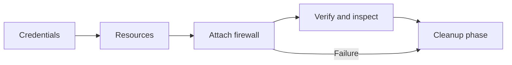
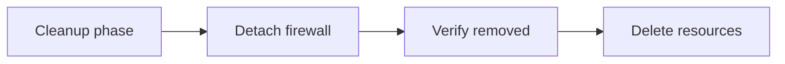

# Test Harness

This document describes the DigitalOcean Cloud Firewall role test harness.
Local test operations run through Workspace, which owns the repository Docker
Compose environment.

## Table of Contents

- [Coverage](#coverage)
- [Setup](#setup)
- [Workspace Commands](#workspace-commands)
- [DigitalOcean Live Tests](#digitalocean-live-tests)
- [Jenkinsfile Lint](#jenkinsfile-lint)
- [Clean Up](#clean-up)
- [Notes](#notes)

## Coverage

The test harness creates:

- one temporary DigitalOcean Droplet
- one temporary DigitalOcean Cloud Firewall

It then exercises the role twice:

- `present` attaches the Droplet to the firewall and verifies membership
- `absent` detaches the Droplet from the firewall and verifies removal

The harness runs locally against the DigitalOcean API. It does not SSH into the
temporary Droplet.

## Setup

Install the Workspace CLI before running the test commands if `ws` is not
already available.

```bash
WS_VERSION=0.4.1
curl --output ./ws --location "https://github.com/my127/workspace/releases/download/${WS_VERSION}/ws"
chmod +x ws && sudo mv ws /usr/local/bin/ws
```

Workspace commands read local attributes from `workspace.override.yml`. Create
it from the example first:

```text
cp workspace.override.yml.example workspace.override.yml
```

Set the Workspace attributes needed for the commands you plan to run:

| Attribute | Used by | Purpose |
| --- | --- | --- |
| `test.digitalocean.api_token` | Live tests | DigitalOcean API token used to create and delete the temporary Droplet and Cloud Firewall. |
| `test.digitalocean.project_name` | Live tests | Optional DigitalOcean project name for assigning the temporary Droplet. |
| `ansible.galaxy.token` | Release commands | Ansible Galaxy API token used by token-required Galaxy checks, status, and import commands. |
| `github.api_token` | Release commands | GitHub API token used by GitHub release checks and publication commands. |

For example:

```ruby
attribute('test.digitalocean.api_token'): 'dop_v1_xxxxxxxxxxxxxxxxxxxxxxxxxxxxxxxx'
attribute('test.digitalocean.project_name'): ''
attribute('ansible.galaxy.token'): 'your-galaxy-token'
attribute('github.api_token'): 'your-github-token'
```

Only `test.digitalocean.api_token` is required for live tests. The release
attributes are not needed for live testing, but keeping them in the same
gitignored override file lets the Workspace release commands use the same
local configuration surface.

Set `test.digitalocean.project_name` only when the temporary test Droplet should
be assigned to an existing DigitalOcean project.

For direct Ansible runs without Workspace, create the gitignored test variable
file instead:

```text
cp tests/test_variables.example.yml tests/test_variables.yml
```

```yaml
digitalocean_cloud_firewall_test_api_token: "dop_v1_xxxxxxxxxxxxxxxxxxxxxxxxxxxxxxxx"
# digitalocean_cloud_firewall_test_project_name: "existing-project-name"
```

For Workspace commands, `workspace.override.yml` values take precedence over
shell exports. If the Workspace attribute is blank, `DIGITAL_OCEAN_API_TOKEN`,
`DO_OAUTH_TOKEN`, or `DIGITAL_OCEAN_PROJECT_NAME` from the shell can provide
the value instead. The live playbook then prefers those environment values over
`tests/test_variables.yml`.

For direct Ansible runs without Workspace, `DIGITAL_OCEAN_API_TOKEN`,
`DO_OAUTH_TOKEN`, and `DIGITAL_OCEAN_PROJECT_NAME` from the shell take
precedence over `tests/test_variables.yml`.

## Workspace Commands

The preferred local entrypoint is Workspace:

```text
ws
```

Useful commands:

```text
ws ansible syntax
ws ansible lint
ws ansible playbook tests/playbook.yml tests/inventory
ws lint-jenkinsfile
ws test-live provision
ws test-live cleanup
ws test-live full-cycle
```

Both `ws console` and `ws ansible playbook` load live-test environment values
from `workspace.override.yml` and forward them into the `console` container.
The live playbooks also load `tests/test_variables.yml` directly, so manual
Workspace playbook runs and intentional raw Ansible runs both use test
variables.

Use `ws console` with no argument for an interactive shell when a command needs
shell quoting. The non-interactive `ws console <command>` form is intentionally
limited to simple whitespace-separated commands used by Workspace helpers.

Use `ws ansible syntax` for syntax checks and `ws ansible lint` for role linting.

## DigitalOcean Live Tests

The live-test command has three explicit phases:

```text
ws test-live provision
ws test-live cleanup
ws test-live full-cycle
```

`provision` creates the temporary Droplet and Cloud Firewall, attaches the
Droplet to the firewall, verifies the attached state, and leaves the billable
resources running for manual inspection.

`cleanup` detaches matching test Droplets from matching test Cloud Firewalls
when they are still attached, verifies the detached state through the role, and
then removes the Cloud Firewall and Droplet resources. It is idempotent and can
be run after an interrupted or already-cleaned test.

`full-cycle` is the CI-safe path. It runs `provision`, then always runs
`cleanup`, including when provisioning or validation fails.

For manual playbook runs, use the Workspace wrapper from the repository root:

```text
ws ansible playbook tests/playbook.yml tests/inventory
ws ansible playbook tests/playbook_cleanup.yml tests/inventory
```

The provision playbook:

- creates one small DigitalOcean Droplet
- creates one Cloud Firewall
- runs the role in `present` mode and verifies Droplet membership

The cleanup playbook runs the role in `absent` mode when matching resources are
still attached, verifies membership removal, and deletes the temporary
resources. The diagrams split provision and cleanup so Markdown previews can
render each flow without one oversized horizontal canvas.

The provisioning phase creates the temporary resources, attaches the Droplet to
the firewall, validates membership, and then hands the full-cycle path to
cleanup.



The cleanup phase starts from the same handoff node and removes the firewall
membership before deleting the temporary resources.



## Jenkinsfile Lint

Validate the repository `Jenkinsfile` with the Workspace Jenkins lint
controller and the Jenkins Declarative Pipeline linter:

```text
ws lint-jenkinsfile
```

This command starts the Workspace `console` and `jenkins-lint` Compose services
and runs the helper inside the `console` container.

## Clean Up

If a live run is interrupted, or after a manual `provision` inspection, destroy
all test resources with Workspace:

```text
ws test-live cleanup
```

To run only the cleanup playbook through Workspace:

```text
ws ansible playbook tests/playbook_cleanup.yml tests/inventory
```

## Notes

- The harness provisions real Droplets and Cloud Firewalls, so it incurs cost.
- No AWS credentials are required; only DigitalOcean credentials are used.
- The harness does not SSH into the test Droplet, so SSH keys and SSH agent
  forwarding are not part of this role's live-test setup.
- Live-test Droplets can be assigned to the DigitalOcean project configured by
  `test.digitalocean.project_name` in `workspace.override.yml`, or by
  `digitalocean_cloud_firewall_test_project_name` in `tests/test_variables.yml`
  for direct Ansible runs.
- `workspace.override.yml` and `tests/test_variables.yml` must stay untracked
  because they may contain local secrets.
- Test resources are named
  `ansible-digitalocean-cloud-firewall-<inventory-name>` and tagged with
  `ANSIBLE-TEST`.
